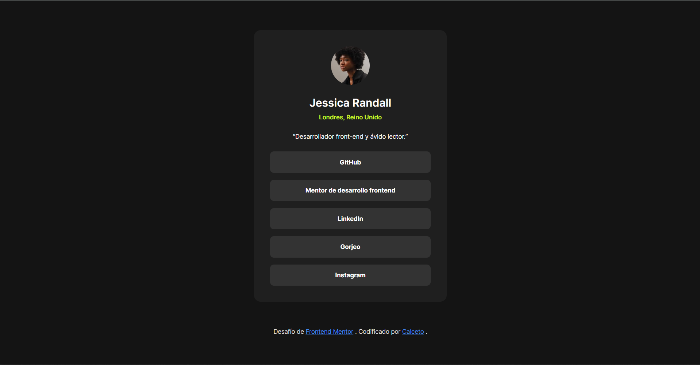

# Social links profile

Solución al reto [Social Links Profile](https://www.frontendmentor.io/challenges/social-links-profile-UG32l9m6dQ) de Frontend Mentor.

## Vista previa

## Construido con

- HTML5 semántico
- Propiedades personalizadas de CSS
- Flexbox
- Mobile-first

## Lo que aprendí

- Cómo usar variables CSS con `:root` para centralizar los colores y reutilizarlos en toda la hoja de estilos
- La diferencia entre `:focus` y `:focus-visible`, y por qué `:focus-visible` es el estándar moderno para accesibilidad con teclado
- Cómo funciona `clamp()` matemáticamente, incluyendo cómo calcular el valor ideal en `vw` según el tamaño de pantalla objetivo
- Que `<q>` es el elemento semántico correcto para citas cortas en línea
- Cómo usar `<ul>` y `<li>` para listas de enlaces de navegación

## Autor

- Frontend Mentor: [@Calceto23](https://www.frontendmentor.io/profile/Calceto23)
- GitHub: [@Calceto23](https://github.com/Calceto23)